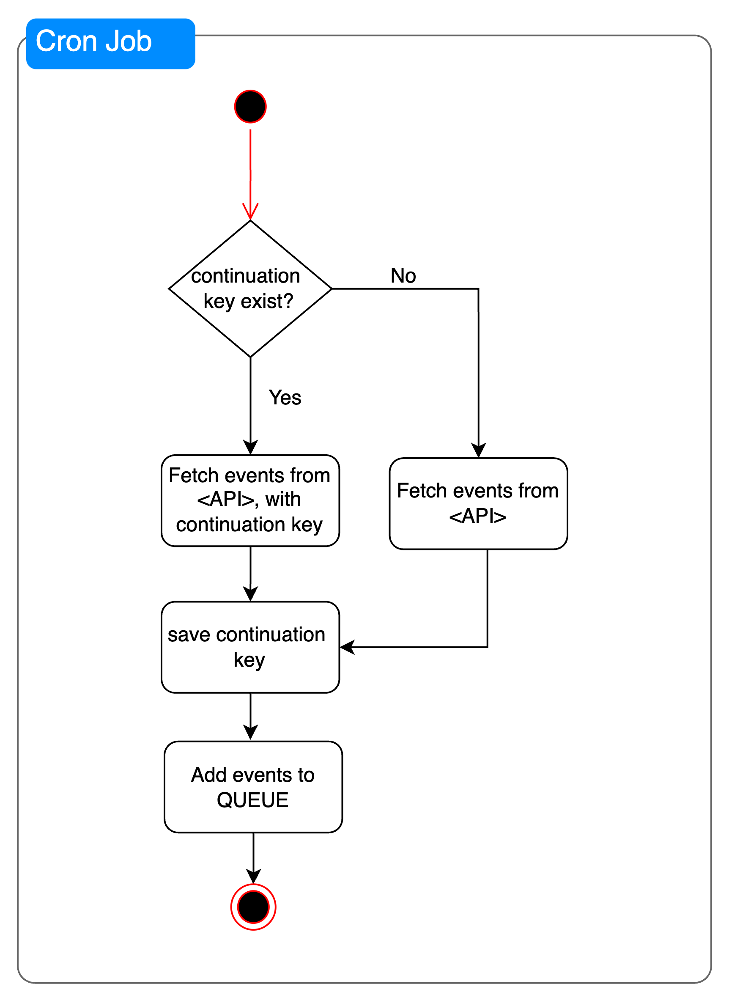

## Project Decisions
NestJS (https://docs.nestjs.com/) was chosen as it helps to quickly bootstrap a Node.js project in TypeScript, so that I can focus on solving the problem at hand.

## Requirements
- Node v18.17.0 or above
- Redis
- MySql

### Installation
- In project folder `yarn install`
- Run `yarn migrate` to run pending migrations
- Run `yarn start:dev`

## Creating New Migrations
Say you have created a new entity file e.g `activity.entity.ts`, you can generate a migration file for it with the following commands:

### Generate Migration file
Say you have choosing the name `CreateActivityEntity` to be the name of he migration file, run:

```bash
yarn migration:generate
```

A file will be generated into the `./src/database/migrations/` folder with the timestamp prepended e.g `./src/database/migrations/1713280153289-CreateActivityEntity.ts`

## Run the migration file
After inspecting the generated file and verifying that all is well, run the migration:
```bash
yarn migration:run   
 ```

<h1 align="center">
  Architecture
</h1>

## Code Architecture
- Use of `exception filters` to handle exceptions and also log them
- Use of `winston-logger` as the logging library, I added placeholder for sending the logs to Sentry
- All services core to the problem are in the `components/` folder

## System Architecture

My solution runs a Cron Job that will fetch events from the API at intervals (can be configured as required) see `./src/components/activity-manager/event-poll.service.ts`.

The fetch event functionality adds the events to a queue, see the `fetchEvents` method in `./src/components/activity/activity.service.ts`. 

Events are processed in `activity-manager.processor.ts`. To ensure that events are not skipped or missed. A `ContinuationEntity` which will always have just one row holding the current `continuation` key is used. The value of this row is updated everytime a successful fetch from the API is made.

Here is a simple activity diagram of the flow:
### Flow of cron job
<div align="center">
  
</div>

### flow of queue processor
<div align="center">
  
</div>

# Assumptions made
- The assessment document mentioned `validTo`, but that was not present on the object, and I assumed what was meant was `validUntil`
- I assumed that `validFrom` will always be set
- I also assumed that based on the information on the assessment document, I can leave how how the processing of the listing are handled in my implementation